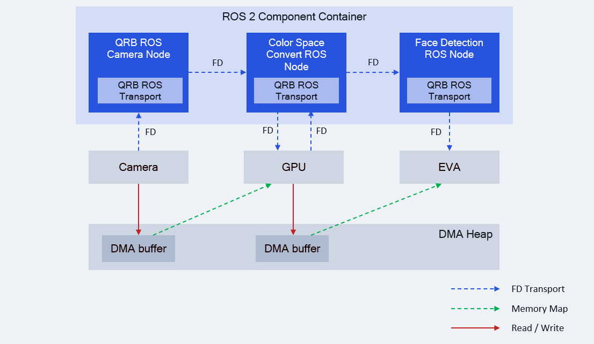

<div align="center">
  <h1>QRB ROS Transport</h1>
  <p align="center">
  </p>
  <p>QRB ROS Transport is designed for zero-copy transporting ROS messages on Qualcomm robotics platforms.</p>

  <a href="https://ubuntu.com/download/qualcomm-iot" target="_blank"></a>
  <a href="https://docs.ros.org/en/jazzy/" target="_blank"></a>

</div>

---

## 👋 Overview

The [qrb_ros_transport](https://github.com/qualcomm-qrb-ros/qrb_ros_transport) is designed for zero-copy transporting ROS messages on Qualcomm robotics platforms.

It is implemented based on [REP 2007](https://ros.org/reps/rep-2007.html), which provides interfaces to define methods for serializing custom types and/or using those types in intra-process communication without conversion.

<div align="center">
  
</div>

<br>

The `qrb_ros_transport` sends image DMA buffer file descriptors (fd) between ROS nodes, rather than sending the image data itself.

Hardware accelerators, such as cameras, GPUs, and EVA, share image data zero-copy through mmap DMA buffers.

## 🔎 Table of contents
  * [Supported types](#-supported-types)
  * [Supported targets](#-supported-targets)
  * [Installation](#-installation)
  * [Usage](#-usage)
  * [Build from source](#-build-from-source)
  * [Contributing](#-contributing)
  * [Contributors](#%EF%B8%8F-contributors)
  * [License](#-license)

## ⚓ Supported types

| QRB ROS Transport Type          | ROS Interfaces          |
| :------------------------------- | :----------------------- |
| [qrb_ros::transport::type::Image](./qrb_ros_transport_image_type/include/qrb_ros_transport_image_type/image.hpp) | [sensor_msgs::msg::Image](https://github.com/ros2/common_interfaces/blob/rolling/sensor_msgs/msg/Image.msg) |
| [qrb_ros::transport::type::Imu](./qrb_ros_transport_imu_type/include/qrb_ros_transport_imu_type/imu.hpp) | [sensor_msgs::msg::Imu](https://github.com/ros2/common_interfaces/blob/rolling/sensor_msgs/msg/Imu.msg) |
| [qrb_ros::transport::type::PointCloud2](./qrb_ros_transport_point_cloud2_type/include/qrb_ros_transport_point_cloud2_type/point_cloud2.hpp) | [sensor_msgs::msg::PointCloud2](https://github.com/ros2/common_interfaces/blob/rolling/sensor_msgs/msg/PointCloud2.msg) |


## 🎯 Supported targets

<table >
  <tr>
    <th>Development Hardware</th>
    <td>Qualcomm Dragonwing™ RB3 Gen2</td>
    <td>Qualcomm Dragonwing™ IQ-9075 EVK</td>
  </tr>
  <tr>
    <th>Hardware Overview</th>
    <th><a href="https://www.qualcomm.com/developer/hardware/rb3-gen-2-development-kit"></a></th>
    <th><a href="https://www.qualcomm.com/products/internet-of-things/industrial-processors/iq9-series/iq-9075"></a></th>
  </tr>
</table>

---

## ✨ Installation

> [!IMPORTANT]
> **PREREQUISITES**: The following steps need to be run on **Qualcomm Ubuntu** and **ROS Jazzy**.<br>
> Refer to [Install Ubuntu on Qualcomm IoT Platforms](https://ubuntu.com/download/qualcomm-iot) and [Install ROS Jazzy](https://docs.ros.org/en/jazzy/index.html) to set up your environment. <br>
> For Qualcomm Linux, please check out the [Qualcomm Intelligent Robotics Product SDK](https://docs.qualcomm.com/bundle/publicresource/topics/80-70018-265/introduction_1.html?vproduct=1601111740013072&version=1.4&facet=Qualcomm%20Intelligent%20Robotics%20Product%20(QIRP)%20SDK) documents.

Add Qualcomm IOT PPA for Ubuntu:

```bash
sudo add-apt-repository ppa:ubuntu-qcom-iot/qcom-noble-ppa
sudo add-apt-repository ppa:ubuntu-qcom-iot/qirp
sudo apt update
```

Install Debian package:

```bash
sudo apt install ros-jazzy-qrb-ros-transport-*
```

## 🚀 Usage

This section shows how to use `qrb_ros_transport` in your projects, Here, we use `qrb_ros::transport::type::Image` as an example.

Add the dependencies in your `package.xml`:

```xml
<depend>qrb_ros_transport_image_type</depend>
```

Use `ament_cmake_auto` to find dependencies in your `CMakeLists.txt`:

```cmake
find_package(ament_cmake_auto REQUIRED)
ament_auto_find_build_dependencies()
```

<details open><summary>Using adapted types in your ROS node</summary>

```c++
#include "qrb_ros_transport_image_type/image.hpp"

// Create message
auto msg = std::make_unique<qrb_ros::transport::type::Image>();
msg->header = std_msgs::msg::Header();
msg->width = width;
msg->height = height;
msg->encoding = "nv12";

// Allocate dmabuf for message
auto dmabuf = lib_mem_dmabuf::DmaBuffer::alloc(size, "/dev/dma_heap/system");
// ... set data to dmabuf
msg->dmabuf = dmabuf;

// Publish message
pub->publish(std::move(msg));
```
</details>

---

## 👨‍💻 Build from source

### Dependencies
Install dependencies `ros-dev-tools`:

```shell
sudo add-apt-repository ppa:ubuntu-qcom-iot/qcom-noble-ppa
sudo add-apt-repository ppa:ubuntu-qcom-iot/qirp
sudo apt update

sudo apt install ros-dev-tools \
  ros-jazzy-lib-mem-dmabuf \
  ros-jazzy-qrb-sensor-client \
  ros-jazzy-pcl-conversions
```

### Build
Download the source code and build it with colcon

```bash
source /opt/ros/jazzy/setup.bash
git clone https://github.com/qualcomm-qrb-ros/qrb_ros_transport.git
colcon build
```

## 🤝 Contributing

We love community contributions! Get started by reading our [CONTRIBUTING.md](CONTRIBUTING.md).<br>
Feel free to create an issue for bug report, feature requests or any discussion💡.

## ❤️ Contributors

Thanks to all our contributors who have helped make this project better!

<table>
  <tr>
    <td align="center"><a href="https://github.com/penww"><br /><sub><b>penww</b></sub></a></td>
    <td align="center"><a href="https://github.com/jiaxshi"><br /><sub><b>jiaxshi</b></sub></a></td>
    <td align="center"><a href="https://github.com/quic-zhaoyuan"><br /><sub><b>quic-zhaoyuan</b></sub></a></td>
  </tr>
</table>

## 📜 License

Project is licensed under the [BSD-3-Clause](https://spdx.org/licenses/BSD-3-Clause.html) License. See [LICENSE](./LICENSE) for the full license text.
